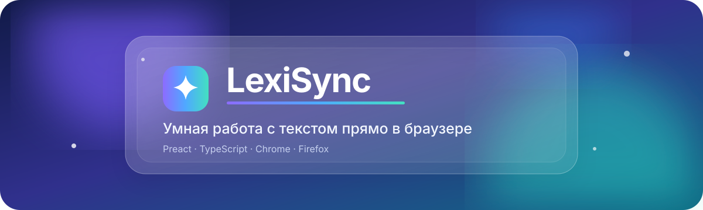
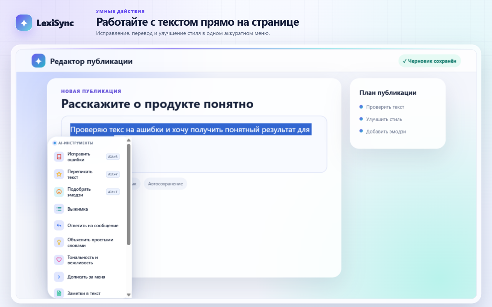
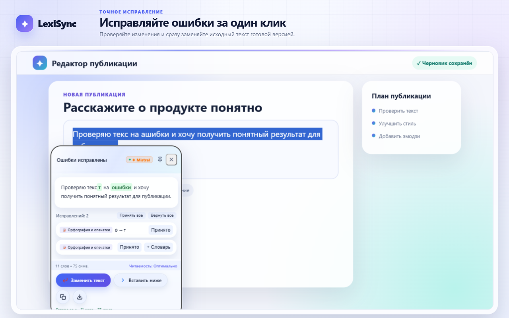
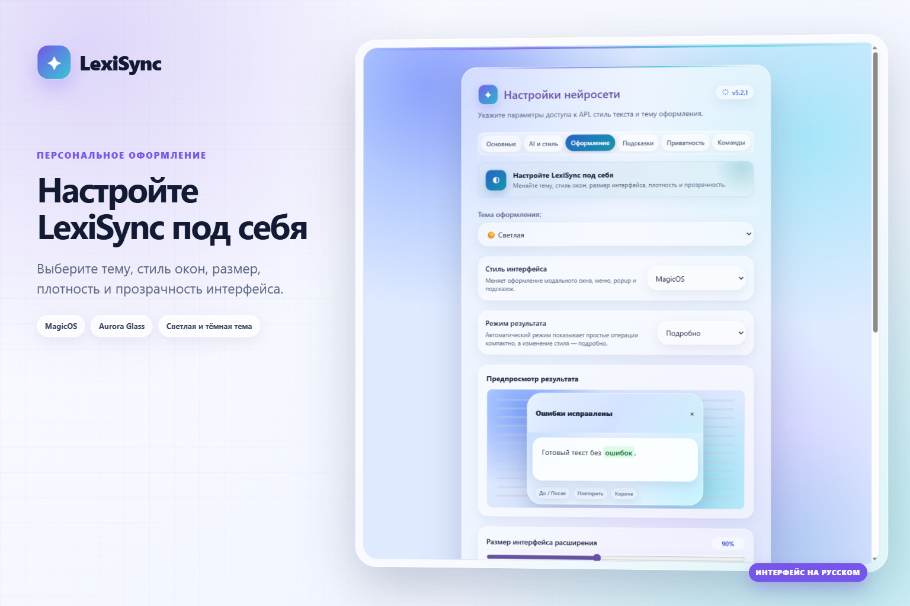
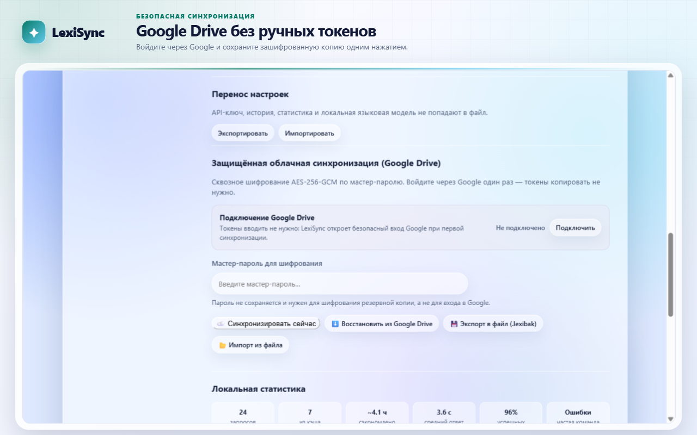
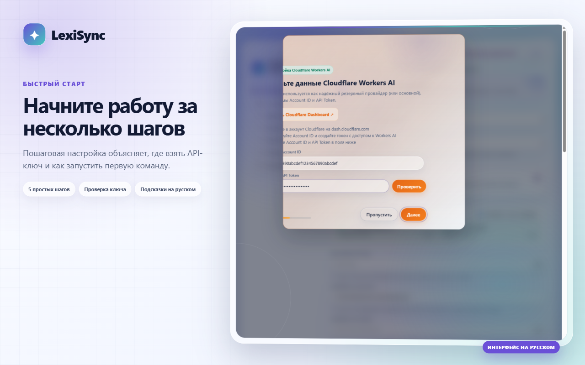
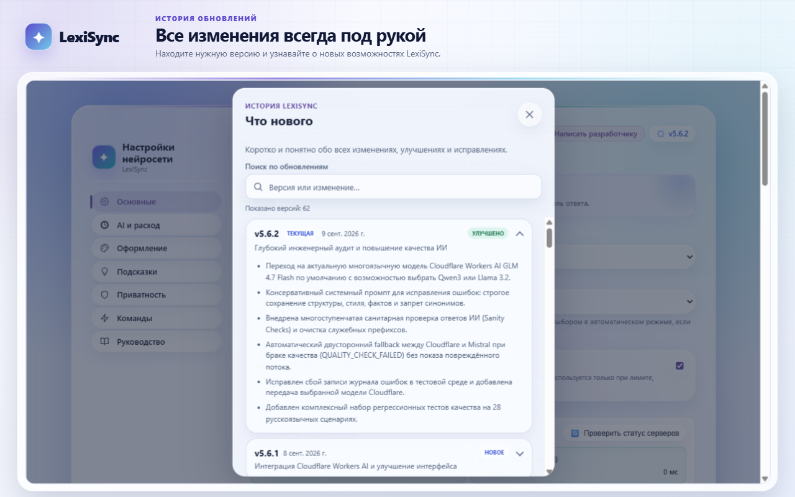

# ✨ LexiSync — расширение для Chrome и Firefox



<p align="center">
  <a href="https://chromewebstore.google.com/detail/%D0%BA%D0%BE%D1%80%D1%80%D0%B5%D0%BA%D1%82%D0%BE%D1%80-%D0%B3%D1%80%D0%B0%D0%BC%D0%BC%D0%B0%D1%82%D0%B8%D0%BA%D0%B8-%D0%B8-%D0%BE%D1%80/iacebnbpapcgjlplkeapekjeoljfdpgl"><strong>Установить из Chrome Web Store</strong></a>
  ·
  <a href="https://addons.mozilla.org/ru/firefox/addon/65facfa619b74330bdfa/"><strong>Установить из Firefox Add-ons</strong></a>
  ·
  <a href="https://github.com/Kiryuhak/LexiSync/releases/latest">Скачать архивы</a>
  ·
  <a href="docs/RELEASING.md">Инструкция по выпуску</a>
</p>

Кросс-браузерное расширение для Chrome и Firefox на базе **Mistral AI**. Позволяет исправлять ошибки, переписывать и переводить текст, менять раскладку, добавлять эмодзи и распознавать текст на изображениях.

<h2 align="center">✨ Как работает LexiSync</h2>

<p align="center">
  Выделите текст, выберите нужное действие и примените готовый результат — всё прямо на странице.
</p>

<p align="center">
  
</p>

<details>
  <summary><strong>🪄 Работа с текстом — меню и готовый результат</strong></summary>
  <br>
  <p align="center">
    
    
  </p>
</details>

<details>
  <summary><strong>🎨 Оформление и приватность</strong></summary>
  <br>
  <p align="center">
    
    
  </p>
</details>

<details>
  <summary><strong>🚀 Быстрый старт и история обновлений</strong></summary>
  <br>
  <p align="center">
    
    
  </p>
</details>

## ✨ Что нового в 5.2.7

- **🌐 Доступ ко всем сайтам и встроенным фреймам:** Режим работы на всех сайтах в один клик и умное автоопределение сторонних iframe (Stepik, Coursera, CodePen и др.).
- **⚡ Горячая клавиша `Ctrl+Enter` / `Cmd+Enter`:** Мгновенная вставка текста с автозаменой или быстрое копирование результата.
- **📊 Счётчик изменений текста:** Наглядная статистика (слова, символы и % сжатия/расширения) прямо в строке статуса.
- **🕒 Оптимизированная История на IndexedDB:** Кнопка «Сбросить фильтры» в один клик и плавная порционная подгрузка записей (`IntersectionObserver`).
- **🎯 Улучшенный Live-Proofread:** Закрытие карточки по `Escape` и клику снаружи без случайного сброса полей, быстрое применение исправлений по `Ctrl+Enter`.
- **🔁 Быстрый повтор (Quick Re-run):** Отдельная кнопка последнего выполненного действия в тулбаре выделения текста.
- **🧹 Фоновая очистка кэша и индикатор токенов:** Автоматическое удаление устаревших AI-ответов старше 7 дней и предупреждающий бейдж токенов при выделении больших текстов (>4000 знаков).

## 🚀 Основные возможности

- **📝 Исправление ошибок (Alt+R):** Автоматическая проверка орфографии и пунктуации.
- **🎭 Смена стиля (Alt+Y):** Переписывание выделенного текста в заданном тоне (деловой, дружеский и т.д.).
- **😊 Подбор эмодзи (Alt+T):** Нейросеть анализирует контекст и предлагает подходящие по смыслу эмодзи.
- **🌐 Переводчик:** Умный контекстный перевод с автоопределением исходного языка.
- **⌨️ Смена раскладки:** Быстрое исправление текста, набранного в неправильной раскладке (например, `ghbdtn` -> `привет`).
- **🕒 История запросов на IndexedDB:** Локальное хранение истории с поиском, фильтрами, избранным, экспортом JSON и быстрым сбросом.
- **📸 Mistral OCR (Alt+S):** Распознавание текста в выбранной области экрана через специализированный OCR API.
- **🔒 Управление контекстом:** Передача окружения, заголовка и домена страницы выключена по умолчанию и включается только пользователем.
- **✅ Выбор исправлений:** Каждое исправленное слово можно принять, вернуть или добавить в личный словарь.
- **↩️ Отмена замены:** Исходный текст можно вернуть сразу после применения результата.
- **✨ Персональные подсказки:** Локальное дополнение слов и предсказание следующего слова с принятием по `Tab`; функция включается пользователем и не обрабатывает чувствительные поля.
- **⚡ Пользовательские AI-команды:** До восьми собственных инструкций, которые доступны прямо в меню выделенного текста.
- **🪄 Доработка результата:** Редактирование ответа, сравнение «до/после», повтор запроса и быстрые уточнения длины и тона.
- **🌍 Настройки для сайта:** Отдельное управление подсказками, историей и передачей контекста для текущего домена.
- **🧭 Быстрый старт:** Пошаговая первоначальная настройка и интерфейс на русском или английском языке.
- **⚡ Режимы AI:** Быстрый режим для повседневных операций и качественный режим для сложного переписывания.
- **📚 Глоссарий и профили:** Закреплённые переводы терминов и отдельные инструкции для почты, чатов и публикаций.
- **🌐 Автопрофили по доменам:** Профиль стиля автоматически применяется на привязанных сайтах.
- **🛡️ Доступ только к выбранным сайтам:** Постоянное разрешение выдаётся отдельно текущему домену через всплывающее окно; при установке расширение не получает доступ ко всем страницам.
- **▸ Потоковый результат:** Ответ Mistral появляется по мере генерации, запрос можно отменить без ожидания полного ответа.
- **⌨️ Локальная раскладка:** Исправление неправильной раскладки работает без сети и API-ключа.
- **⭐ Расширенная история:** Избранное, повтор операции и создание пользовательской команды из результата.
- **📦 Перенос настроек:** Безопасный экспорт, импорт и синхронизация несекретных предпочтений.
- **📊 Локальная статистика:** Количество запросов, попадания в кэш и средняя задержка без внешней телеметрии.
- **🪟 Гибкое отображение:** Компактный результат включён по умолчанию; доступны автоматический и подробный режимы.
- **🎨 Варианты интерфейса:** Liquid Glass, MagicOS, Aurora Glass, Material Design 3 и Flutter Clean со светлой, тёмной и системной темами.

## 🛠 Технологии и архитектура

- **Язык:** TypeScript 6 в строгом режиме
- **Сборка:** WXT 0.21 + Vite
- **API:** WebExtensions Manifest V3, Mistral AI API
- **Хранилище:** IndexedDB для истории запросов, chrome.storage.local с автоочисткой TTL для кэша и настроек
- **Интерфейс:** Чистый Vanilla DOM (без runtime-накладных расходов), Shadow DOM изоляция, кэширование SVG-шаблонов (`cloneNode`), CSS-переменные

## 🎯 Качество и тестирование

Проект покрыт сценариями ручного тестирования. Особое внимание при разработке и проверке уделено следующим аспектам:

- **Устойчивость API:** Временные ошибки обрабатываются ограниченным числом внутренних попыток, после чего пользователь сам решает, повторять ли запрос.
- **Изоляция UI:** Всплывающий интерфейс размещается в Shadow DOM и не конфликтует со стилями веб-страниц.
- **Граничные случаи при работе с DOM:** Безопасная вставка и замена текста в различных типах узлов (`<input>`, `<textarea>`, `contenteditable`), включая сохранение фокуса и позиции каретки.
- **Безопасность данных:** Строгая типизация данных при записи и чтении из асинхронного `chrome.storage.local`.
- **Приватное хранение:** История и кэш отключены в приватных окнах и могут быть запрещены для выбранных доменов.
- **Автоматическая проверка:** GitHub Actions на Node.js 24 проверяет форматирование, ESLint, TypeScript, зависимости готового расширения, требования Manifest V3 и целостность ZIP, запускает модульные тесты с покрытием, функциональные сценарии Chrome и проверку запуска Firefox.
- **Доступность и адаптивность:** Автоматический axe-аудит страниц расширения и визуальные контракты для ширины 320, 625 и 1000 пикселей.
- **Редакторы и фреймы:** E2E-проверки замены в `contenteditable` и работы горячих клавиш внутри iframe.

## ⚙️ Разработка и сборка

```bash
npm ci                   # воспроизводимая установка из package-lock.json
npm run dev              # Chrome с автоматическим обновлением
npm run dev:firefox      # Firefox с автоматическим обновлением
npm run build            # финальные сборки обоих браузеров
npm run zip              # архивы для Chrome Web Store и Firefox AMO
npm run xpi:firefox      # XPI для временной локальной установки Firefox
npm run clean:artifacts  # удалить старые архивы релизов, сохранив текущую версию
npm run typecheck        # строгая проверка TypeScript
npm run lint             # статический анализ ESLint
npm run format:check     # проверка форматирования Prettier
npm run test:unit        # модульные тесты Vitest без запуска браузера
npm run test:coverage    # модульные тесты с порогами покрытия
npm run test:e2e         # функциональные тесты Chrome
npm run test:firefox     # временная установка сборки в Firefox через web-ext
npm run screenshots:store # обновить русские скриншоты для README и витрины
npm run verify:manifests # проверка разрешений финальных манифестов
npm run verify:release   # финальные ZIP, MV3, целостность и Firefox Add-ons
npm run test:all         # полный набор автоматических проверок
```

Для разработки рекомендуется Node.js 24; минимальная поддерживаемая версия — 22.15. Готовые релизные сборки создаются в `.output/release/chrome-mv3` и `.output/release/firefox-mv3`. Команды `npm run zip:chrome` и `npm run zip:firefox` создают отдельные архивы для магазинов.

## 📦 Установка

- **Firefox:** установите LexiSync напрямую из [официального каталога Firefox Add-ons](https://addons.mozilla.org/ru/firefox/addon/65facfa619b74330bdfa/).
- **Chrome для разработки:** откройте `chrome://extensions/`, включите режим разработчика и выберите `.output/release/chrome-mv3`.
- **Firefox для разработки:** команда `npm run xpi:firefox` создаёт в корне проекта XPI для временной установки через `about:debugging#/runtime/this-firefox`. Постоянная установка обычным пользователем требует файла, подписанного Mozilla Add-ons.

## 🔑 Начало работы

1. Зарегистрируйтесь на платформе [Mistral AI](https://console.mistral.ai/) и создайте API-ключ.
2. Откройте настройки LexiSync через меню расширения.
3. Вставьте ключ в поле «Mistral API Key», выберите тональность по умолчанию и нажмите «Сохранить».
4. Выделите текст на веб-странице и вызовите LexiSync через всплывающую кнопку или сочетание клавиш.

## Что вошло в LexiSync 5

Пятая версия развивает компактное рабочее пространство для текста:

- три альтернативных варианта каждого результата;
- фоновая проверка текста при вводе с зелёной подсветкой исправлений;
- дневные и месячные лимиты, приблизительный учёт токенов и экономичный режим;
- безопасное атомарное резервирование бюджета для параллельных запросов;
- отклонение отдельных исправлений и исключения автопроверки по сайтам;
- отмена последней замены и локальный диагностический отчёт без личного текста;
- редактор акцентного цвета, скругления, плотности, прозрачности и размера текста.

Основные действия доступны из меню выделенного текста и по горячим клавишам. Параметры автопроверки перенесены во вкладку «Подсказки», а лимиты запросов — во вкладку «AI и стиль».

API-ключ хранится отдельно от обычных настроек в приватном хранилище расширения и не включается в экспорт.
Инструкции по автоматическому выпуску находятся в [`docs/RELEASING.md`](docs/RELEASING.md).

## Конфиденциальность

Порядок обработки выделенного текста, API-ключа, локальной истории и данных сторонними сервисами описан в [политике конфиденциальности LexiSync](PRIVACY.md).

## Лицензия

LexiSync распространяется по лицензии [ISC](LICENSE). Владелец авторских прав — Kiryuhak.
