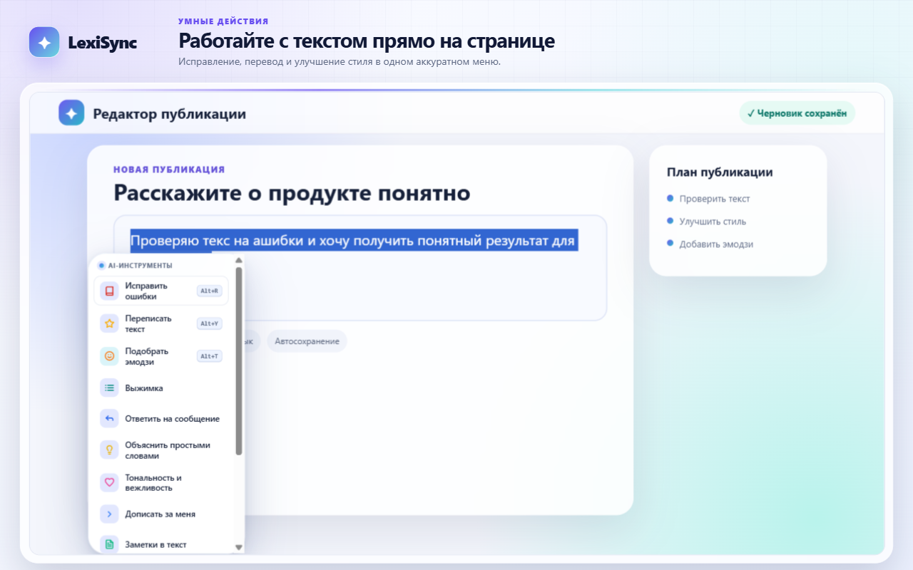
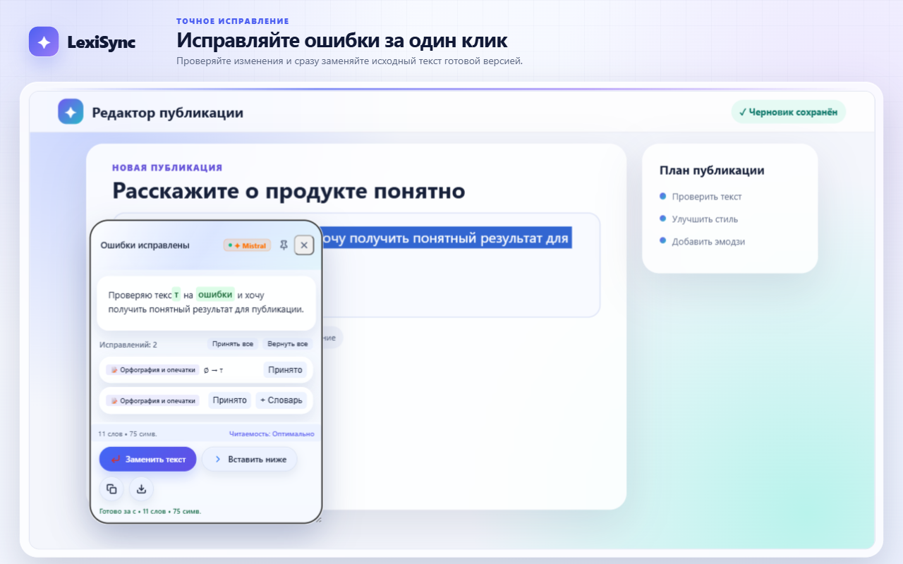
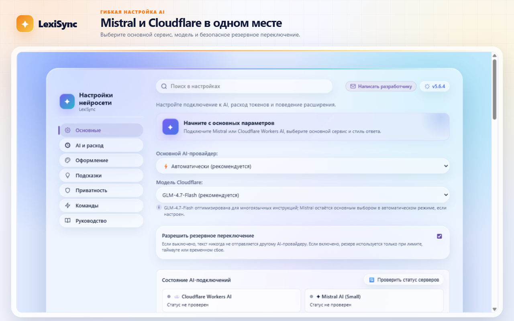
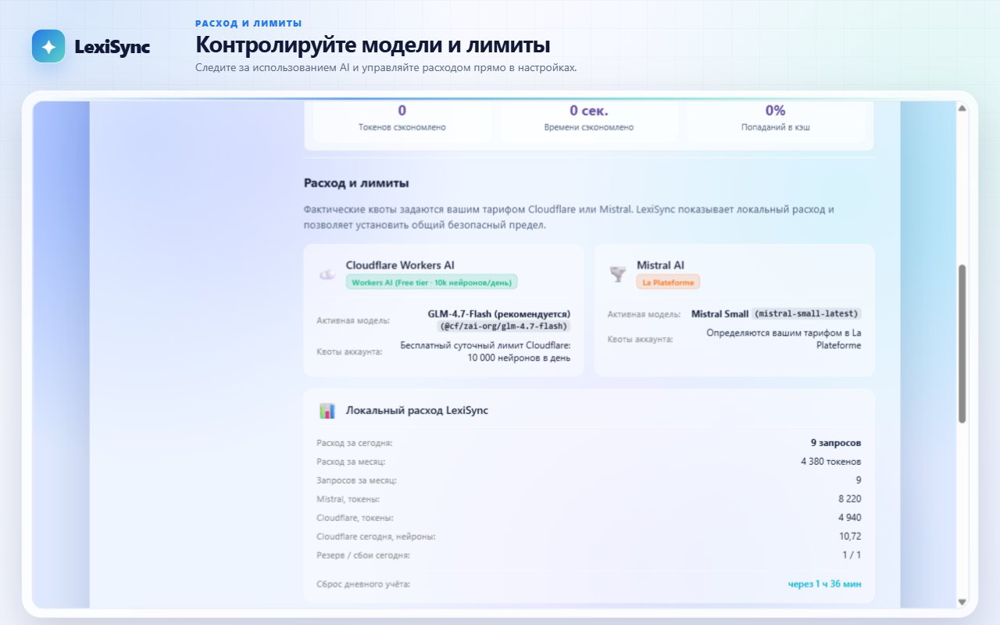

# ✨ LexiSync — расширение для Chrome и Firefox


<p align="center">
  <a href="https://chromewebstore.google.com/detail/%D0%BA%D0%BE%D1%80%D1%80%D0%B5%D0%BA%D1%82%D0%BE%D1%80-%D0%B3%D1%80%D0%B0%D0%BC%D0%BC%D0%B0%D1%82%D0%B8%D0%BA%D0%B8-%D0%B8-%D0%BE%D1%80/iacebnbpapcgjlplkeapekjeoljfdpgl"><strong>Установить из Chrome Web Store</strong></a>
  ·
  <a href="https://addons.mozilla.org/ru/firefox/addon/65facfa619b74330bdfa/"><strong>Установить из Firefox Add-ons</strong></a>
  ·
  <a href="https://github.com/Kiryuhak/LexiSync/releases/tag/v5.6.4"><strong>Релиз v5.6.4</strong></a>
  ·
  <a href="docs/RELEASING.md">Инструкция по выпуску</a>
</p>

<p align="center">
  
  
  
  
  
  
</p>

Кросс-браузерное расширение для Chrome и Firefox на базе **Mistral AI** (`mistral-small-latest`, `mistral-ocr-latest`) и **Cloudflare Workers AI** (`@cf/zai-org/glm-4.7-flash`, `@cf/qwen/qwen3-30b-a3b-fp8`, `@cf/meta/llama-3.2-3b-instruct`). Позволяет исправлять ошибки, переписывать и переводить текст, менять раскладку, подбирать эмодзи и распознавать текст на изображениях напрямую из браузера.

<h2 align="center">✨ Интерфейс LexiSync 5.6.4</h2>

<p align="center">
  Новая русскоязычная галерея для Chrome и Firefox: без обрезанного интерфейса, тестовых ключей и служебных данных.
</p>

<p align="center">
  
</p>

<details>
  <summary><strong>🪄 Google Chrome — меню и готовый результат</strong></summary>
  <br>
  <p align="center">
    
    
  </p>
</details>

<details>
  <summary><strong>🤖 Google Chrome — AI-провайдеры и контроль расходов</strong></summary>
  <br>
  <p align="center">
    
    
  </p>
</details>

<details>
  <summary><strong>🦊 Mozilla Firefox — приватность и быстрый старт</strong></summary>
  <br>
  <p align="center">
    
    
  </p>
</details>

## ✨ Что нового в 5.6.4

- **Точные ошибки Google Drive:** истёкшая авторизация, отключённый Drive API, недостаточные разрешения и ограничения запросов больше не смешиваются в одно сообщение о входе.
- **Без лишней OAuth-авторизации:** ответы `403` не удаляют рабочий токен и не открывают повторный вход без необходимости.
- **Контролируемое ожидание:** зависший запрос резервного копирования завершается понятным сообщением вместо бесконечной загрузки.
- **Проверено в Firefox:** OAuth, зашифрованное резервное копирование и восстановление подтверждены реальным runtime-тестом.
- **Безопасная production-сборка:** временное диагностическое логирование удалено; токены, OAuth-ответы, мастер-пароль и содержимое копии не выводятся в журнал.

Предыдущие изменения — в [CHANGELOG](CHANGELOG.md) и истории обновлений внутри расширения.

## 🚀 Основные возможности

- **📝 Исправление ошибок (Alt+R):** автоматическая проверка орфографии и пунктуации с пословной цветовой diff-подсветкой, категоризацией ошибок (орфография, пунктуация, -тся/-ться, НЕ/НИ, согласование, типографика), краткими подсказками правил и кнопками массового применения («Принять все» / «Вернуть все»).
- **📊 Метрики текста и удобочитаемость (0 токенов):** мгновенный подсчёт слов и символов с дельтой изменения, расчёт времени чтения и индекс удобочитаемости по шкале Флеша (легко / оптимально / сложный текст) прямо в окне результата.
- **📥 Действие «Вставить ниже» (Append):** удобная альтернатива полной замене текста — вставка готового результата с новой строки ниже выделения с поддержкой мгновенной отмены (Undo).
- **🎯 Цели письма и адаптация (Writing Goals):** переписывание под нужную аудиторию (коллеги, клиенты, руководство) и коммуникативные цели (убедить, проинформировать, объяснить, сделать лаконичнее).
- **🎭 Смена тональности (Alt+Y):** переписывание выделенного текста в выбранном стиле (деловой, дружеский, лаконичный, убедительный и др.).
- **⚡ Тихое исправление на месте:** мгновенная правка опечаток и раскладки клавиатуры за 0 мс прямо в поле ввода без вызова внешних окон.
- **😊 Подбор эмодзи (Alt+T):** нейросеть анализирует смысл текста и предлагает подходящие по контексту эмодзи.
- **🌐 Умный контекстный переводчик:** точный перевод с автоопределением исходного языка на более чем 10 мировых языков.
- **⌨️ Смена раскладки клавиатуры:** быстрое исправление текста, случайно набранного не в той раскладке (например, `ghbdtn` → `привет`).
- **📸 Распознавание текста / OCR (Alt+S):** извлечение текста из скриншотов, презентаций и невыделяемых областей экрана на базе Mistral OCR.
- **✨ Персональные подсказки:** локальное дописывание слов на лету по нажатию клавиши `Tab`.
- **🛡️ Локальная маскировка PII:** автоматическая маскировка email, телефонов, номеров банковских карт, IP-адресов и токенов до отправки запроса в AI с безопасным восстановлением в готовом результате.
- **📚 Галерея команд и свои AI-действия:** создание собственных инструкций и удобная библиотека готовых шаблонов.
- **⚡ Текстовые макросы:** локальное раскрытие пользовательских сокращений в полях ввода без обращения к серверу.
- **🧰 Локальный типограф и чистка:** расстановка кавычек «ёлочек», длинного тире, неразрывных пробелов, исправление опечаток CapsLock и очистка мусора за 0 токенов без обращения к API.
- **🕒 История запросов на IndexedDB:** локальное хранилище до 500 записей с поиском, фильтрацией, избранным и экспортом в форматы JSON, CSV или Markdown.
- **💡 Понятный разбор исправлений:** кнопка «Почему так?» объясняет правила русского языка и грамматики простыми словами.
- **📋 Мультиформатный буфер обмена:** копирование как форматированного текста для Word / Google Docs, так и чистого Plain Text.
- **🎨 7 современных стилей оформления:** Liquid Glass, MagicOS, Aurora Glass, Material Design 3, Flutter Clean, Vision Aurora и Silk Obsidian со светлой и тёмной темами.
- **🔒 Полный контроль приватности:** запросы к AI отправляются только по прямому действию пользователя. Отсутствует внешняя телеметрия, поддержаны приватные вкладки и белый список исключений сайтов.

## 🛠 Технологии и архитектура

- **Язык:** TypeScript 7 в строгом режиме с дополнительной проверкой совместимости на TypeScript 6.
- **Сборка:** WXT 0.21 + Vite 8 (оптимизированные легковесные бандлы для Chrome и Firefox).
- **API:** WebExtensions Manifest V3, Mistral AI REST API, Cloudflare Workers AI REST API.
- **Хранилище:** IndexedDB для истории и chrome.storage.local с автоочисткой TTL для кэша и настроек.
- **Интерфейс:** нативный Vanilla DOM (без тяжелых runtime-фреймворков), Shadow DOM для полной изоляции стилей на сайтах, SVG-шаблоны и нативные CSS-переменные.

## 🎯 Качество и тестирование

Проект покрыт всесторонними автоматическими тестами:

- **Устойчивость сети и API:** контроль таймаутов первого чанка и активности потока, учёт заголовков `Retry-After`, cooldown-период провайдеров и защита от циклических повторов.
- **Изоляция интерфейса:** все всплывающие окна и панели монтируются в Shadow DOM и защищены от CSS-правил сторонних страниц.
- **Работа с DOM:** безопасная вставка и замена текста в любых полях ввода (`<input>`, `<textarea>`, `contenteditable`, фреймы) с сохранением позиции каретки и истории отмены (Undo/Redo).
- **Безопасность данных:** строгая валидация входящих сообщений Service Worker, доверенные отправители секретов (`isInternalCaller`), санитизация логов от токенов и ключей.
- **Приватность:** история и кэш автоматически отключаются в инкогнито/приватных окнах.
- **CI/CD пайплайн:** GitHub Actions на Node.js 24 проверяет Prettier, ESLint, типы, локализацию, безопасность зависимостей, манифесты и запускает полный набор unit- и E2E-тестов в Chromium и Firefox.

## ⚙️ Разработка и сборка

```bash
npm ci                   # Воспроизводимая установка зависимостей
npm run dev              # Режим разработки Chrome с автообновлением
npm run dev:firefox      # Режим разработки Firefox с автообновлением
npm run build            # Финальная сборка для Chrome и Firefox
npm run zip              # Сборка готовых ZIP-архивов для магазинов
npm run xpi:firefox      # Создание XPI для временного тестирования в Firefox
npm run check:static     # Комплексная проверка: типы, линт, форматирование, i18n, svg
npm run check:i18n       # Проверка синхронизации ключей локализации ru/en
npm run typecheck        # Проверка типов Native TypeScript (TS7)
npm run typecheck:legacy # Проверка совместимости TypeScript 6
npm run lint             # Статический анализ кода через ESLint
npm run format:check     # Проверка соблюдения код-стайла Prettier
npm run test:unit        # Модульные тесты Vitest
npm run test:coverage    # Запуск тестов с формированием отчёта о покрытии
npm run test:e2e         # E2E-тестирование сценариев Chrome Playwright
npm run test:firefox     # E2E-тестирование сценариев Firefox Playwright
npm run test:all         # Полный запуск всех тестов и проверок
npm run verify:release   # Проверка релизных архивов, манифестов и web-ext lint
```

Для разработки рекомендуется **Node.js 24** (минимальная поддерживаемая версия — 22.15). Релизные пакеты формируются в каталогах `.output/release/chrome-mv3` и `.output/release/firefox-mv3`.

## 📦 Установка

- **Chrome Web Store:** установите расширение из [официального каталога Chrome Web Store](https://chromewebstore.google.com/detail/%D0%BA%D0%BE%D1%80%D1%80%D0%B5%D0%BA%D1%82%D0%BE%D1%80-%D0%B3%D1%80%D0%B0%D0%BC%D0%BC%D0%B0%D1%82%D0%B8%D0%BA%D0%B8-%D0%B8-%D0%BE%D1%80/iacebnbpapcgjlplkeapekjeoljfdpgl).
- **Firefox Add-ons:** установите LexiSync из [официального каталога Mozilla Add-ons (AMO)](https://addons.mozilla.org/ru/firefox/addon/65facfa619b74330bdfa/).
- **Chrome (ручная установка):** выполните `npm run build:chrome`, откройте страницу `chrome://extensions/`, включите _Режим разработчика_, нажмите _Загрузить распакованное расширение_ и выберите папку `.output/release/chrome-mv3`.
- **Firefox (ручная установка):** выполните `npm run build:firefox` (или `npm run xpi:firefox`), перейдите на страницу `about:debugging#/runtime/this-firefox`, нажмите _Загрузить временное дополнение..._ и укажите файл `.output/release/firefox-mv3/manifest.json` или полученный `.xpi`.

## 🔑 Начало работы

1. **Получите ключи AI-сервисов:**
    - **Mistral AI:** создайте аккаунт на [console.mistral.ai](https://console.mistral.ai/) и сгенерируйте API-ключ.
    - **Cloudflare Workers AI:** войдите в [Cloudflare Dashboard](https://dash.cloudflare.com/), скопируйте **Account ID** (в боковой панели аккаунта) и создайте **API Token** («My Profile» → «API Tokens») с шаблоном или разрешениями «Account - Workers AI - Read».
2. **Настройте провайдеров:**
    - Откройте настройки LexiSync через иконку на панели браузера или контекстное меню.
    - Вставьте полученные ключи в соответствующие поля и нажмите **Проверить**.
    - Выберите основной сервис (_Автоматически_, _Mistral AI_ или _Cloudflare Workers AI_), модель Cloudflare и при необходимости включите автоматический fallback.
3. **Используйте возможности LexiSync:**
    - Выделите любой текст на странице и выберите нужное действие во всплывающем меню или воспользуйтесь сочетаниями клавиш (`Alt+R` — проверка орфографии, `Alt+Y` — стиль, `Alt+S` — OCR-распознавание).

### Режимы и ограничения AI

- **Экономичный:** исходный текст не обрезается, но ответ ограничен 1 536 токенами. Выполняется один запрос к выбранному провайдеру и, только при подтверждённом временном сбое или браке качества, один fallback.
- **Сбалансированный:** использует тот же безопасный маршрут, но допускает до 3 072 токенов ответа для перевода, резюме и сложного редактирования. Дополнительные скрытые AI-вызовы не выполняются.
- **Локальный лимит LexiSync** — установленное пользователем ограничение запросов и токенов. Это защита от случайного расхода, а не официальная квота провайдера.
- Лимиты **Mistral** зависят от организации, тарифа и модели; актуальные запросы/с, токены/мин и месячный объём нужно смотреть на [странице лимитов Mistral](https://docs.mistral.ai/admin/billing-usage/usage-limits). LexiSync не показывает выдуманные фиксированные значения.
- Бесплатная квота **Cloudflare Workers AI** составляет 10 000 нейронов в сутки и сбрасывается в 00:00 UTC; для генерации текста действует [отдельный rate limit](https://developers.cloudflare.com/workers-ai/platform/limits/). Токены и нейроны — разные единицы; если API возвращает `usage.neurons`, LexiSync сохраняет это фактическое значение отдельно. Актуальные условия приведены на [официальной странице цен](https://developers.cloudflare.com/workers-ai/platform/pricing/).
- После `429` используется `Retry-After`, если он присутствует. Иначе включается ограниченная растущая пауза. Пока сервис на паузе, повторная команда сразу использует доступный fallback; если оба сервиса временно недоступны, сетевой запрос не отправляется.

### Синхронизация с Google Drive

Синхронизация работает в Chrome и Firefox и использует только OAuth-разрешение `drive.appdata` для закрытой папки приложения `appDataFolder`.

1. Откройте **Настройки → Приватность** и придумайте мастер-пароль для шифрования резервной копии.
2. Нажмите **Синхронизировать сейчас**. При первом запуске браузер откроет вход Google — вручную копировать токены не требуется.
3. На другом устройстве введите тот же мастер-пароль и нажмите **Восстановить из Google Drive**.

Перед отправкой в Google Drive резервная копия шифруется локально с помощью AES-256-GCM. Мастер-пароль не сохраняется, не отправляется Google и не является паролем аккаунта Google. Если пароль забыт, расшифровать резервную копию невозможно. OAuth используется только для доступа LexiSync к `appDataFolder`. Настройка OAuth для собственных сборок описана в [отдельном руководстве](docs/GOOGLE-DRIVE-OAUTH.md).

## 🔒 Конфиденциальность и безопасность

- Распознавание текста с экрана (OCR, `Alt+S`) использует Mistral OCR и требует настроенного ключа Mistral независимо от выбранного текстового провайдера.
- Все обращения к AI выполняются фоновым процессом расширения напрямую по HTTPS (`https://api.mistral.ai/`, `https://api.cloudflare.com/`). В проекте отсутствуют промежуточные серверы разработчика и внешняя телеметрия.
- AI-ключи не передаются контентным скриптам. Chrome управляет кэшем OAuth Google Drive через браузерный Identity API; Firefox хранит краткоживущий токен в приватной IndexedDB расширения. Токен не включается в резервную копию, а настройки и история остаются локальными, пока пользователь сам не запускает синхронизацию.
- Подробные сведения приведены в [Политике конфиденциальности](PRIVACY.md). Руководство по развёртыванию релизов описано в [`docs/RELEASING.md`](docs/RELEASING.md).

## 📄 Лицензия

LexiSync распространяется по свободной лицензии [ISC](LICENSE). Владелец авторских прав — **Kiryuhak**.
