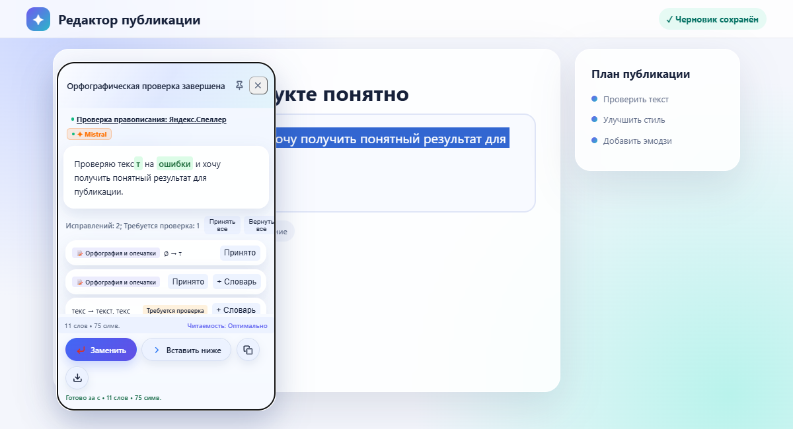
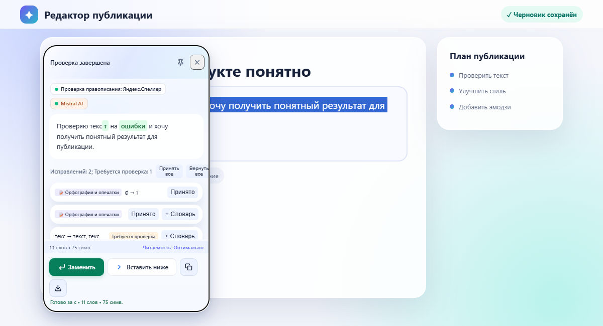

# Технический и визуальный аудит LexiSync, 30.09.2026

Проверены каталоги `src/`, `entrypoints/`, `public/`, `tests/`, `scripts/`, `docs/` и `.github/`. Аудит проведён после выпуска 5.6.11; исправления включены в 5.6.12. Проверки используют реальные сборки расширения в Chromium и Firefox, а ответы внешних API в E2E изолированы тестовыми маршрутами. Работа реальных учётных записей Google, Яндекса и AI-провайдеров без пользовательских ключей здесь не проверялась.

## Карта обработки текста

1. Команда из меню, горячей клавиши или панели настроек попадает в content script (`content.ts`, `content-menus.ts`). Выделение и целевой DOM сохраняются в `selection-state.ts`.
2. `content-request-panel.ts` создаёт панель, управляет жизненным циклом и передаёт запрос в background через port. Закрытие панели отменяет активный запрос.
3. `background.ts` выбирает режим: только Яндекс.Спеллер, только AI или гибридный. В гибридном режиме результат Спеллера становится входом AI.
4. `ai-client.ts` и `provider-health.ts` выбирают основной Mistral или Cloudflare, проверяют кулдаун и допускают один резервный переход. Провайдеры реализованы в `mistral-client.ts` и `cloudflare-client.ts`.
5. `ai-sanity-check.ts` проверяет числа, технические сущности, структуру строк и другие инварианты. Итог и код причины попадают в `error-log.ts` без пользовательского текста.
6. `result-dialog-view.ts` и `content-result-actions.ts` показывают результат. `text-replacement.ts` повторно проверяет сохранённое выделение перед изменением DOM.

Настройки и секреты хранятся отдельно (`settings-store.ts`, `secret-store.ts`); необязательный Google Drive работает через OAuth и зашифрованную резервную копию (`google-drive-auth.ts`, `google-drive-sync.ts`, `crypto-backup.ts`). Контекстные команды, словарь, импорт, onboarding, темы и popup проверены на соответствие этой схеме. Удалять работающий код ради сокращения файлов не потребовалось.

## Подтверждённые проблемы и решения

| Область                           | Наблюдение                                                                                                                      | Изменение                                                                                                                                |
| --------------------------------- | ------------------------------------------------------------------------------------------------------------------------------- | ---------------------------------------------------------------------------------------------------------------------------------------- |
| Яндекс.Спеллер                    | Уже отменённый `AbortSignal` не вызывал обработчик, поскольку слушатель подписывался после отмены. Сетевой запрос мог начаться. | Немедленная проверка сигнала до `fetch`; тест подтверждает ноль вызовов сети.                                                            |
| Позиция панели                    | На экране 280 px панель шириной 264 px оставалась с отступом 20 px и выходила за правый край на 4 px.                           | Горизонтальный отступ зависит от свободного места; при изменении размера окно перепозиционируется. E2E проверяет 280, 320, 375 и 480 px. |
| Кнопка дополнительной AI-проверки | При запуске она удалялась из ряда действий, вызывая скачок геометрии.                                                           | Кнопка остаётся на месте, временно блокируется и показывает состояние «Проверяем через AI…».                                             |
| Иерархия панели                   | Основное и вторичные действия выглядели близко по весу; атрибуция и бейджи имели разные размеры.                                | Основное действие зелёное, вторичные действия контурные, отклонение текстовое, отмена замены вынесена отдельно. Источники унифицированы. |

## Проверенные области без нового подтверждённого дефекта

- Спеллер: POST, языки `ru` и `ru,en`, UTF-16 позиции, неоднозначные предложения, пустой и неверный ответ, 429/5xx, ограничение 10 000 символов. Неоднозначное исправление автоматически не подставляется.
- AI: выбранный основной провайдер, резервный переход, cooldown/probe, потоковый ответ, причины `QUALITY_CHECK_FAILED`, числовые и структурные инварианты. На один запрос допускается один основной и один резервный вызов.
- Безопасность текста: при устаревшем выделении замена блокируется; чувствительные поля исключаются; журнал не содержит текст запроса, ключи и токены.
- Данные и браузеры: локальный кэш, хранение состояния провайдеров, импорт и экспорт, Google Drive/OAuth, контекстное меню, горячие клавиши, Chrome MV3 и Firefox MV3. Внешний OAuth-поток и фактические ответы провайдеров остаются зависимыми от внешних сервисов.
- CI/CD: русские сводки, secret scan, audit, сохранение диагностики E2E, проверка архивов и публикация после полного релизного набора уже действуют; новых ошибок в конфигурации не обнаружено.

## Визуальное сравнение

| До                                         | После                                        |
| ------------------------------------------ | -------------------------------------------- |
|  |  |

Результат остаётся главным содержимым. Зелёная кнопка сохранила смысл успешного действия. Снимки получены в Chromium из собранного расширения, а не нарисованы отдельно. Дополнительные светлые, тёмные и узкие состояния проверяются в `tests/e2e.spec.ts`; снимки теста сохраняются в `test-results/`.

Дополнительные снимки: [280 px, светлая тема](panel-light-280.png), [375 px, светлая тема](panel-light-375.png), [320 px, тёмная тема](panel-dark-320.png), [ошибка AI с сохранённым результатом Спеллера](panel-ai-error.png), [после замены с доступной отменой](panel-after-replacement.png).
